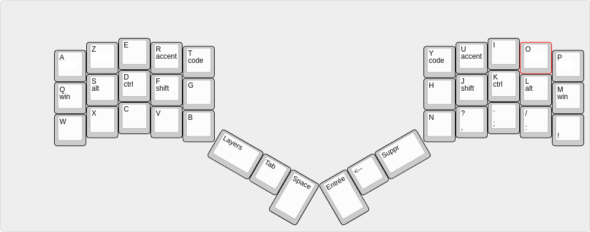
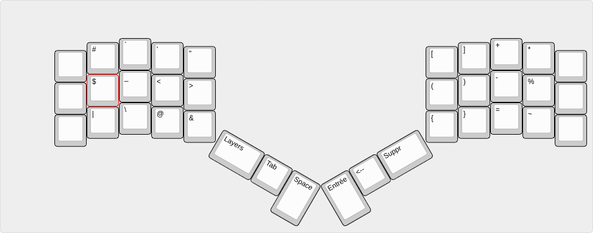
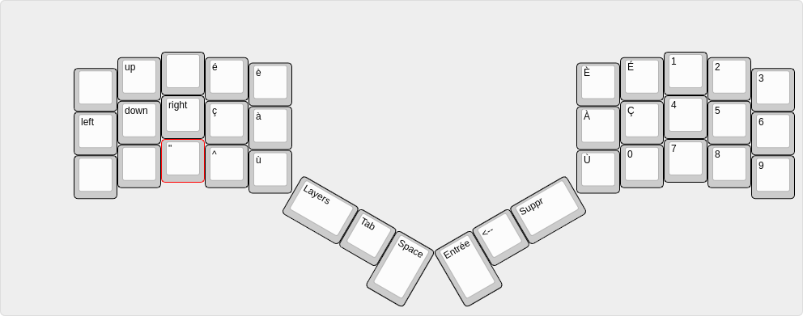

The layer key toggle between layers without having to keep pressing the corresponding modifier key
If you hold the layer key it goes back to the base layer

**BASE LAYER**

**CODE LAYER**

**ACCENTS LAYER**
